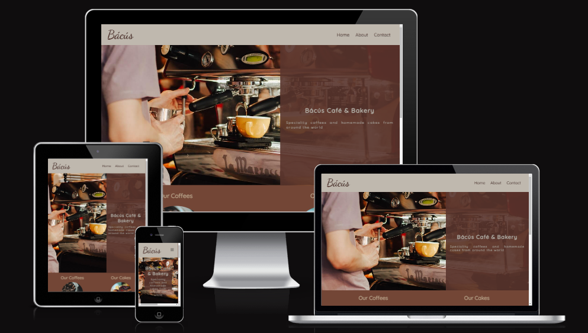
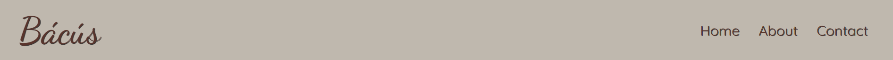
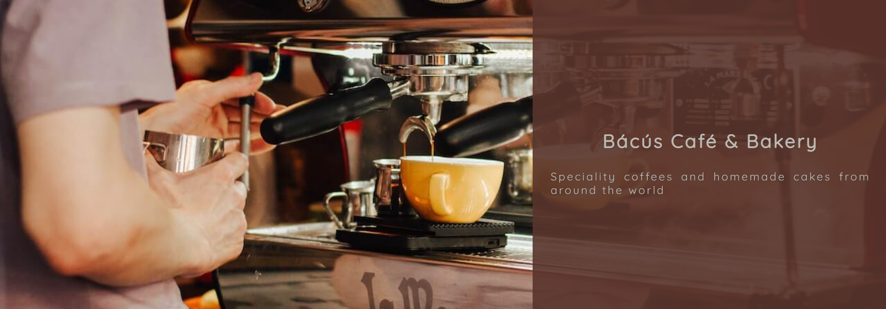
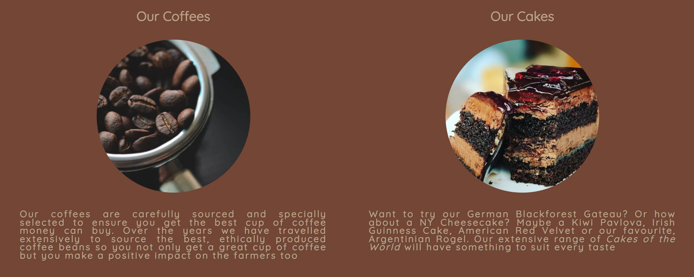
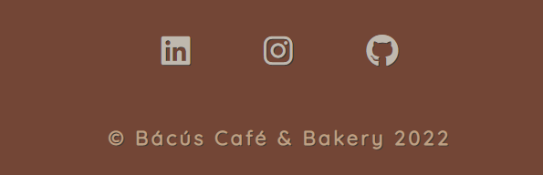

# Bácús Cafe & Bakery
[Live link to deployed GitHub Pages website](https://craig-ryan.github.io/bagus-cafe-and-bakery/)

The Bácús Cafe & Bakery website is a 3 page website consisting of a Home landing page, an about page and a contact page. The website gives users information about the cafe.

Visitors to the website will be greeted by a homepage inviting users to learn about the cafe, it's products, the owner and how to get in touch to avail of catering for private events.

### Table of Contents
1. [Features](#features)
2. [Testing](#testing)
3. [Deployment](#deployment)
4. [Credits](#credits)

## Features

<ul>
    <li>Navigation</li>
        <ul>
            <li>The Cafe's name "Bácús" is featured in the top left hand corner of the page using the color #59342C</li>
            <li>To the right sit the navigation links for the 3 pages included in the website: "Home", "About" and "Contact" which when clicked bring the user to each respective page</li>
            <li>The navigation links provide users with an intuitive layout of what the website consits of and what they will find through each link</li>
            <li>The navigation links are styled to contrast with the background in order to be clearly visible to all users</li>
        </ul>
</ul>

<ul>
    <li>Main</li>
        <ul>
            <li>The main section houses a hero image of a cafe</li>
            <li>There is text sitting on top of the image in a opaque text box to contrast nicely with the main hero image</li>
            <li>This text lets outlines the name "Bácús Cafe and Bakery" and a brief statement about the cafe</li>
        </ul>
</ul>

<ul>
    <li>Products Section</li>
    <ul>
        <li>Using cards, the Cafe's products are laid out for users to view</li>
        <li>Items are presented in blocks of 1 for mobile, 2 for tablet desktop devices</li>
        <li>A heading follwed by an image then by a paragraph is presented to inform users about what products the cafe offers</li>
    </ul>
</ul>
<ul>
    <li>Hygge Section</li>
    <ul>
        <li>Users will find a further "Hygge" section below products inviting customers to enjoy the warm "Hyggeligt" environment between the hours of 6-8pm</li>
        <li>Customers are invited to avail of specialist Danish "Hygge" style pastries and to enjoy a cozy time with friends, co-workers or family in candlelight playing boardgames typical in Danish winter evenings</li>
    </ul>
</ul>

<ul>
    <li>Footer</li>
    <ul>
        <li>This section houses the social media links for the cafe</li>
        <li>Copyright for the cafe is included here</li>
    </ul>
</ul>

<ul>
    <li>About Page</li>
    <ul>
        <li>A hero image of a coffee cup with text reading "About us" greets users at the top of this page</li>
        <li>An introduction to the cafe and it's founder can be found in the main section of the page</li>
        <li>An image and breif bio of its owner are presented here in cascading format for mobile devices and side by side for all other devices</li>
    </ul>
</ul>
<!-- About img here -->
<ul>
    <li>Contact Page</li>
    <ul>
        <li>The same hero image from the about page greets users with the text "Want to get in touch?"</li>
        <li>A contact form can be filled in by customers looking to contact the cafe regarding private catering services offered</li>
        <li>A google maps widget is generated below the contact form for customers to locate the cafe</li>
    </ul>
</ul>

### Wireframes
Wireframe mockups for the site's design can be found [here](link.to.wireframes)
<!-- Contact page img here -->

## Testing

<ul>
    <li>I tested this project across various browsers including Chrome, Brave, Safari & Firefox.</li>
    <li>I also tested it's functionality and responsiveness using the Chrome Developer's Tools and ensured all pages were responsive across all device sizes as intended.</li>
    <li>I ensured that all navigation links, the header, about and contact text are easy to read and intuitive for the user.</li>
    <li>I added the required functionality to the contact form to ensure that only email formats will be accepted when filling in the contact form.</li>
</ul>

### Bugs
<h4>Solved Bugs</h4>
<ul>
    <li></li>
</ul>

### Validator Testing
<ul>
    <li>HTML</li>
    <ul>
        <li>The official W3C validator returned no errors identified in the html files</li>
    </ul>
    <li>CSS</li>
    <ul>
        <li>The official Jigsaw W3C CSS Validator returned no errors from this project's CSS file</li>
    </ul>
    <li>Accessibility</li>
    <ul>
        <li>This project received an accessibility score of % when run through the lighthouse in developer tools</li>
    </ul>
</ul>
<!-- Lighthouse img here -->

#### Unresolved Bugs
No unresolved bugs remain
 

## Deployment

This project was is hosted using GitHub pages. Deployment steps are as follow:

       1. Go to the [project repository](https://github.com/Craig-Ryan/bagus-cafe-and-bakery) and go to the Settings tab
       2. In the side bar on the left click on Pages and then in Build and Development click on the Source dropdown and select Main then save
       3. Wait about 2 minutes then reload the page and the link and option to visit to the deployed project will appear above

Go to the live link - [Bácús Café and Bakery](https://craig-ryan.github.io/bagus-cafe-and-bakery/)

## Credits

### Content
The code to reduce the Navbar items to a condensed hamburger icon was inspired by

https://getcssscan.com/css-buttons-examples

### Media
The images for the hero images across all pages were taken from [photo website](website.com)

Photo by Marta Dzedyshko: https://www.pexels.com/photo/person-using-espresso-machine-2775827/

Photo by Chevanon Photography: https://www.pexels.com/photo/close-up-of-coffee-cup-324028/

Photo by Livier Garcia: https://www.pexels.com/photo/assorted-fruits-on-person-s-hand-1459339/

Photo by Abhinav Goswami: https://www.pexels.com/photo/sliced-cake-on-plate-291528/ 

### Acknowledgements
I would like to thank X, X & X for their help in testing and criticism of this project.

### Technologies Used

https://tinypng.com/

