# Bácús Cafe & Bakery
[Live link to deployed GitHub Pages website](https://craig-ryan.github.io/bacus-cafe-and-bakery/index.html)

The Bácús Cafe & Bakery website is a 3 page website consisting of a Home landing page, an about page and a contact page. The website gives users information about the cafe.

Visitors to the website will be greeted by a homepage inviting users to learn about the cafe, it's products, the owner and how to get in touch to avail of catering for private events.

### Table of Contents
1. [User Experience](#ux)
1. [Features](#features)
1. [Technologies Used](#technologies-used)
2. [Testing](#testing)
3. [Deployment](#deployment)
4. [Credits](#credits)

## UX

### User Stories

- As a customer I want to be able to learn about what products and events the café has.
- As a customer I want to be able to get in contact with the café.
- As a customer I want to be able to find the location of the café.
- As the owner, I want to provide an intuitive website so for my customers to be able to find exactly what they need when visiting the café website.

### Typography

- This project uses the fonts 'Dancing Script' for the site Logo in the nav bar and 'Quicksand' as the main body font as imported from Google fonts with 'Sans-serif' as fallback.

### Color Scheme
- This website uses the Aura color scheme from the [Adobe Color website](https://color.adobe.com/search?q=aura)

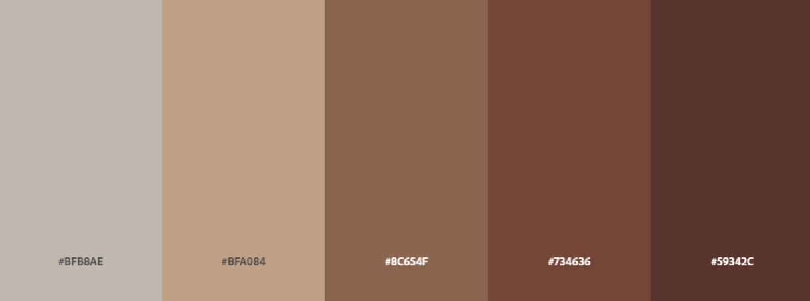

## Features

<ul>
    <li>Navigation</li>
        <ul>
            <li>The Cafe's name "Bácús" is featured in the top left hand corner of the page using the color #59342C</li>
            <li>To the right sit the navigation links for the 3 pages included in the website: "Home", "About" and "Contact" which when clicked bring the user to each respective page</li>
            <li>The navigation links provide users with an intuitive layout of what the website consits of and what they will find through each link</li>
            <li>The navigation links are styled to contrast with the background in order to be clearly visible to all users</li>
        </ul>
</ul>

<ul>
    <li>Main</li>
        <ul>
            <li>The main section houses a hero image of a cafe</li>
            <li>There is text sitting on top of the image in a opaque text box to contrast nicely with the main hero image</li>
            <li>This text lets outlines the name "Bácús Cafe and Bakery" and a brief statement about the cafe</li>
            <li>THe navigation and logo are constant across all pages</li>
        </ul>
</ul>

<ul>
    <li>Products Section</li>
    <ul>
        <li>Using cards, the Cafe's products are laid out for users to view</li>
        <li>Items are presented in blocks of 1 for mobile, 2 for tablet desktop devices</li>
        <li>A heading follwed by an image then by a paragraph is presented to inform users about what products the cafe offers</li>
    </ul>
</ul>
<ul>
    <li>Hygge Section</li>
    <ul>
        <li>Users will find a further "Hygge" section below products inviting customers to enjoy the warm "Hyggeligt" environment between the hours of 6-8pm</li>
        <li>Customers are invited to avail of specialist Danish "Hygge" style pastries and to enjoy a cozy time with friends, co-workers or family in candlelight playing boardgames typical in Danish winter evenings</li>
    </ul>
</ul>

<ul>
    <li>Footer</li>
    <ul>
        <li>This section houses the social media links for the cafe</li>
        <li>Copyright for the cafe is included here</li>
        <li>The footer is constant throughout all pages</li>
    </ul>
</ul>

About Page
    
- A hero image of a coffee cup with text reading "About us" greets users at the top of this page</li>

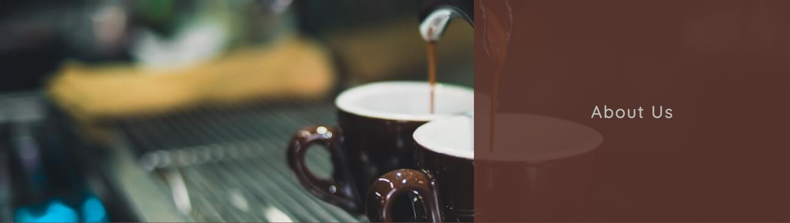

- An introduction to the cafe and it's founder can be found in the main section of the page
- An image and breif bio of its owner are presented here in cascading format for mobile devices and side by side for all other devices

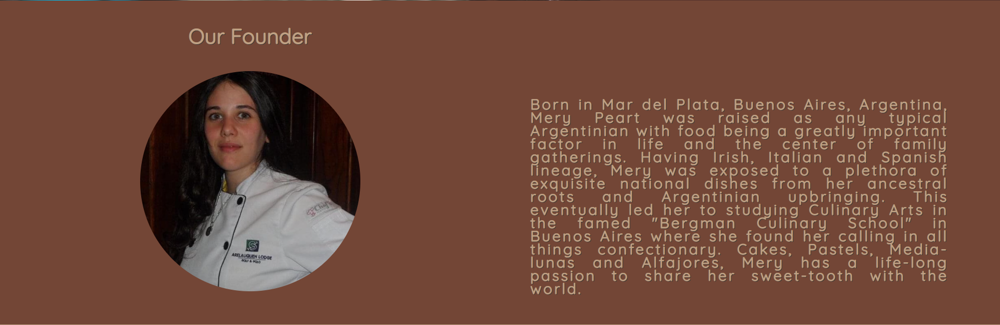

- A call to users to get in touch for any events lies under the about and bio sections with a button that brings users to the contact page

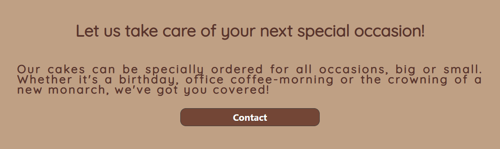
        

Contact Page
    
- The same hero image from the about page greets users with the text "Contact Us"

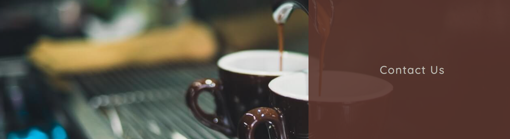

- A contact form can be filled in by customers looking to contact the cafe regarding private catering services offered

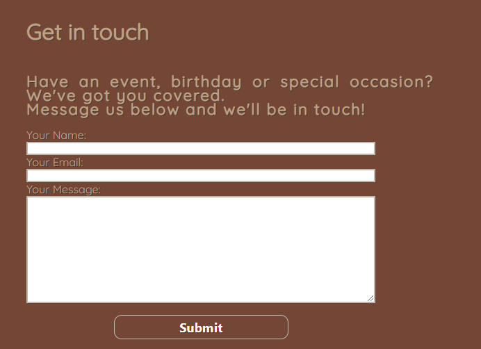

- A google maps widget is generated below the contact form for customers to locate the café

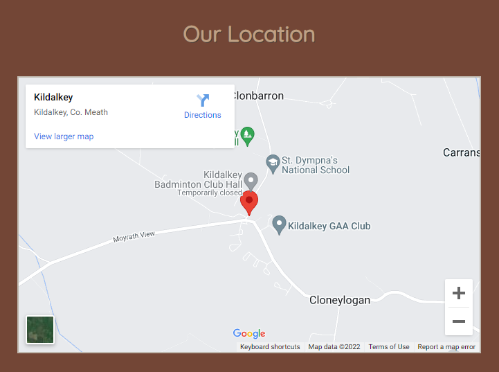

### Wireframes
Wireframe mockups for the site's design were made using Balsamiq

- Index.html

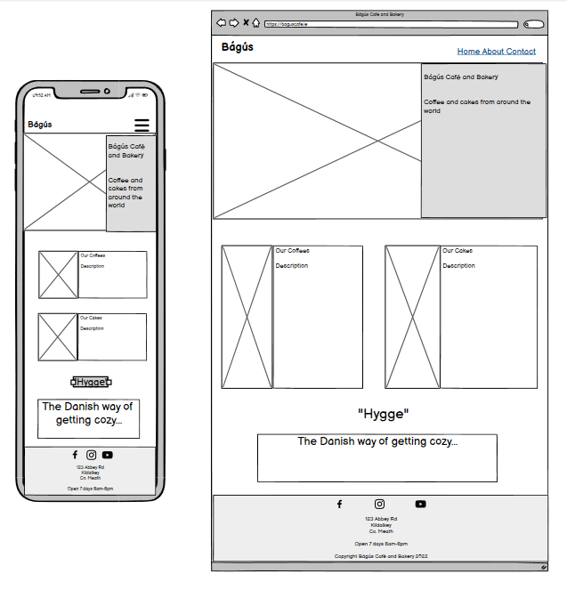

- About.html

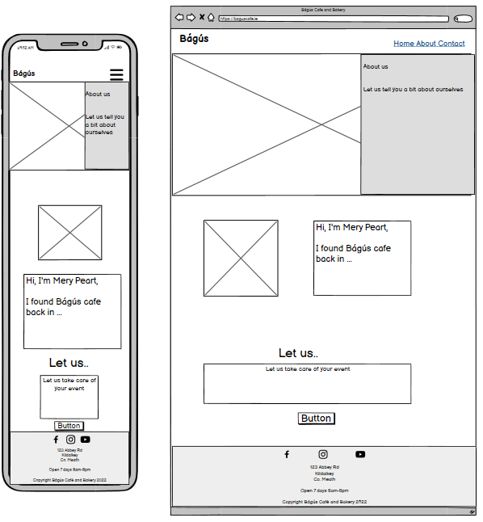

- Contact.html

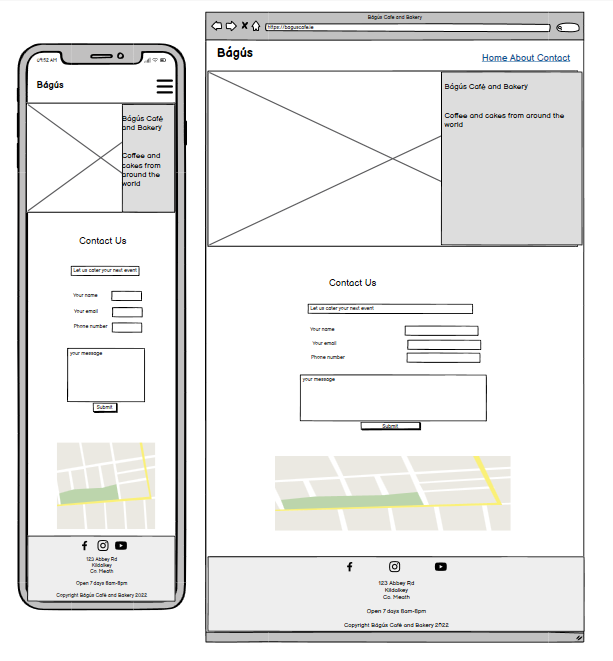

## Technologies Used

### Languages Used

- [HTML5](https://en.wikipedia.org/wiki/HTML5)
- [CSS3](https://en.wikipedia.org/wiki/CSS3)
- [JavaScript](https://en.wikipedia.org/wiki/JavaScript)

### Programs, Frameworks and Libraries Used

[Google Fonts](https://fonts.google.com/)
    - Google fonts was used to import the 2 main font styles of 'Dancing Script' and 'Quicksand'.

[Adobe Color](https://color.adobe.com/)
    - Adobe Color was used for the color scheme.

[Tiny PNG](https://tinypng.com/)
    - Tiny PNG was used to resize images included.

[Balsamiq](https://balsamiq.com/)
    - Balsamiq was used to design the wireframes.

[Pexels](https://www.pexels.com/)
    - Stock images across the project were sourced from Pexels.

[Font Awesome](https://fontawesome.com/)
    - Font Awesome was the source for the social icons in the footer.

[GitHub](https://github.com/)
    - GitHub was used to host and store the code for this project.

[GitPod](https://gitpod.io/)
    - GitPod was used as the IDE for building this project.

[Am I Responsive?](https://ui.dev/amiresponsive/)
    - Am I Responsive was used to provide the responsiveness image housed at the top of this README.md file.

[Lighthouse](https://developer.chrome.com/docs/lighthouse/overview/)
    - Lighthouse in Developer Tools on Google Chrome was used to test SEO, Accessibility, Performance and Best Practices for this project.

[W3C Markup Validator](https://validator.w3.org/)
    - The W3C Markup validator was used to test HTML validity.

[W3C CSS Validator](https://jigsaw.w3.org/css-validator/)
    - The W3C Markup validator was used to test CSS validity.

## Testing

<ul>
    <li>I tested this project across various browsers including Chrome, Brave, Safari & Firefox.</li>
    <li>I tested this project across various screen sizes and devices including iPhone, Samsung, Oppo, Dell & Lenovo mobiles and desktop/laptops.</li>
    <li>I also tested it's functionality and responsiveness using the Chrome Developer's Tools and ensured all pages were responsive across all device sizes as intended.</li>
    <li>I ensured that all navigation links, the header, about and contact text are easy to read and intuitive for the user.</li>
    <li>I added the required functionality to the contact form to ensure that only email formats will be accepted when filling in the contact form.</li>
</ul>

### Lighthouse

I ran Lighthouse on each of the pages to test for best practices, performance, SEO and accessibility and results are displayed below:

- Index.html

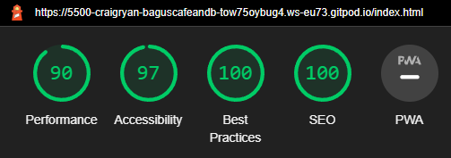

- About.html 

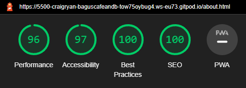

- Contact.html

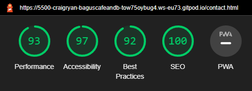

### Bugs

No unresolved bugs remain

### Validator Testing
<ul>
    <li>HTML</li>
    <ul>
        <li>The official W3C validator returned one error identified in the about.html stating that a button element must not appear as a descendant of the a element - I didn't have time to resolve this. Otherwise there are no other errors showing across all html files</li>
    </ul>
    <li>CSS</li>
    <ul>
        <li>The official Jigsaw W3C CSS Validator returned no errors from this project's CSS file</li>
    </ul>
</ul>

 

## Deployment

This project was is hosted using GitHub pages. Deployment steps are as follow:

       1. Go to the [project repository](https://github.com/Craig-Ryan/bagus-cafe-and-bakery) and go to the Settings tab
       2. In the side bar on the left click on Pages and then in Build and Development click on the Source dropdown and select Main then save
       3. Wait about 2 minutes then reload the page and the link and option to visit to the deployed project will appear above

Go to the live link - [Bácús Café and Bakery](https://craig-ryan.github.io/bacus-cafe-and-bakery/index.html)

## Credits

### Content
- The code to reduce the Navbar items to a condensed hamburger icon was inspired by [This youtube video by codeSTACKr](https://www.youtube.com/watch?v=nME3fE3c9Qw&t=179s)

- The buttons on the about and contact pages were made using code from [Get CSS Scan website](https://getcssscan.com/css-buttons-examples)

### Media
The images for the hero images across all pages were taken from [Pexels](https://www.pexels.com/)

- Main hero image on index.html

    [Photo by Marta Dzedyshko](https://www.pexels.com/photo/person-using-espresso-machine-2775827/)

- Coffee beans and cake images on index.html

    [Photo by Abhinav Goswami](https://www.pexels.com/photo/sliced-cake-on-plate-291528/)

    [Photo by Chevanon Photography](https://www.pexels.com/photo/close-up-of-coffee-beans-in-bowl-333523/)

- Hero image on about and contact html pages 

    [Photo by Chevanon Photography](https://www.pexels.com/photo/close-up-of-coffee-cup-324028/)

Social Icons from [Font Awesome](https://fontawesome.com/)

### Acknowledgements
I would like to thank Code Institute for the course materials and structure that allowed me to gain the skills to take on this project. My mentor Marcel for his support during our meetings. My September lwetb colleagues and Kasia Bogucka for their guidance and weekly meetings as well as my friend and family who tested the website and gave me their feedback.

